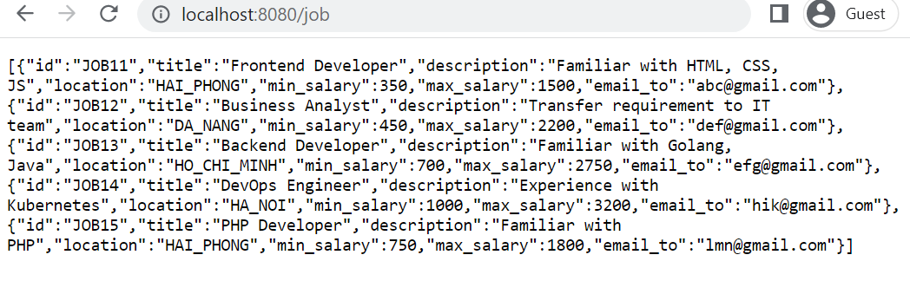
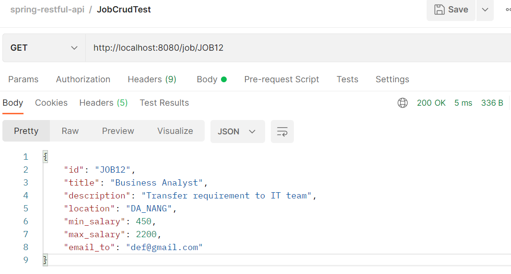
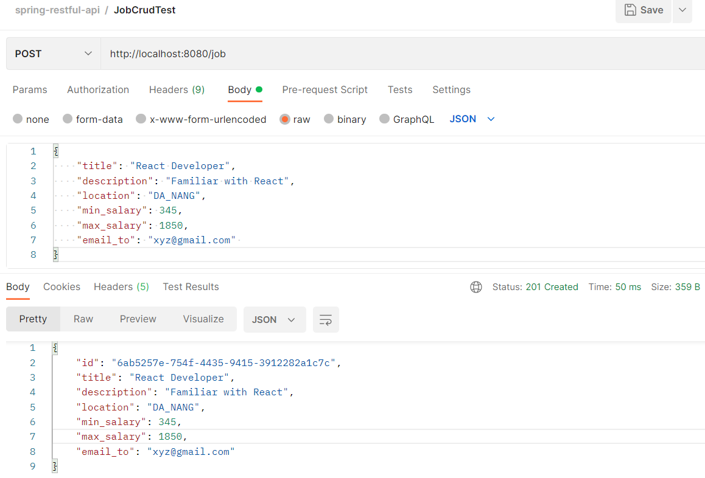
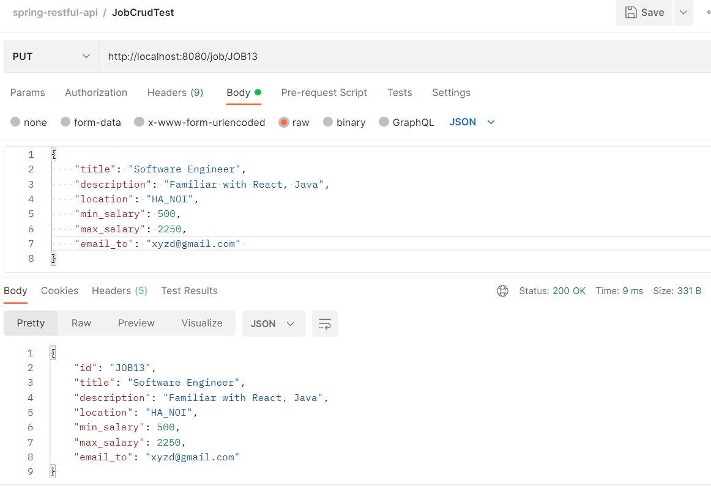
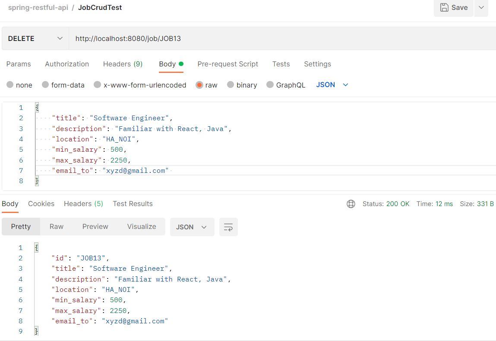
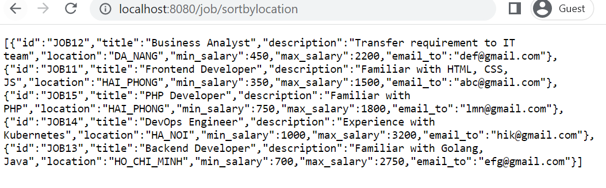
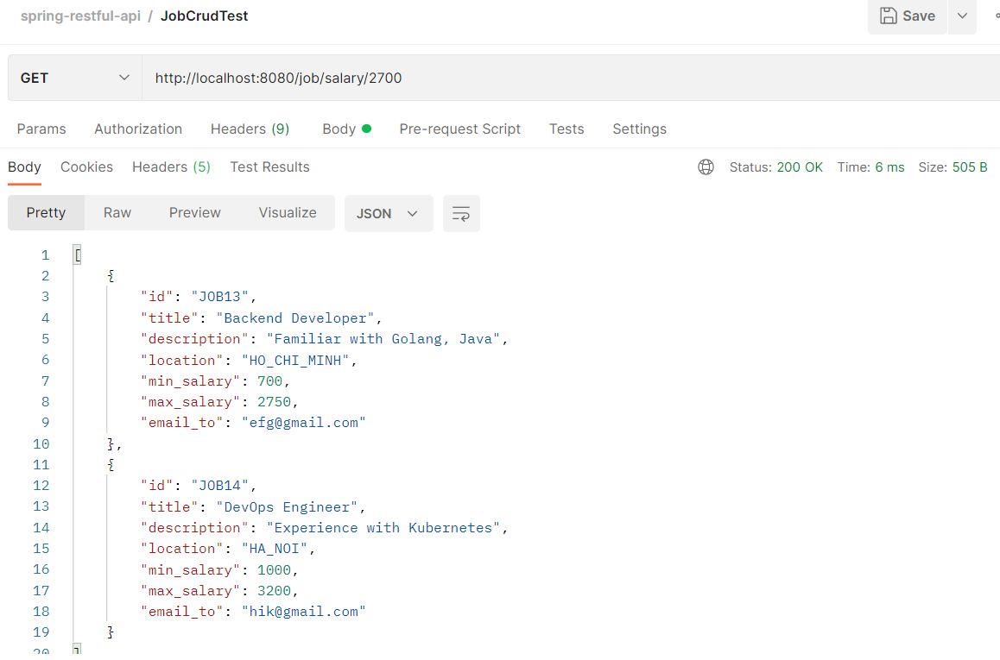
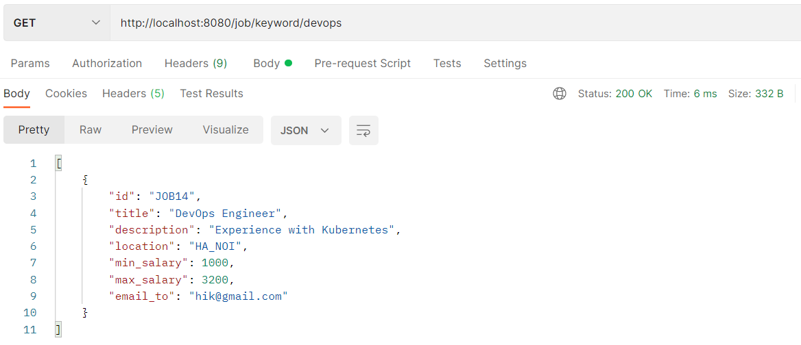
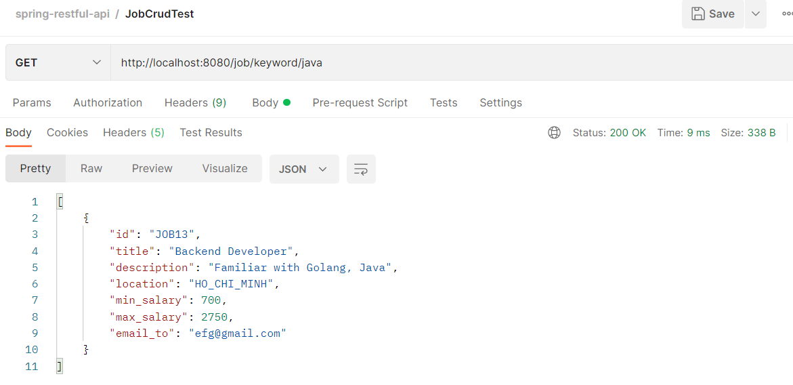
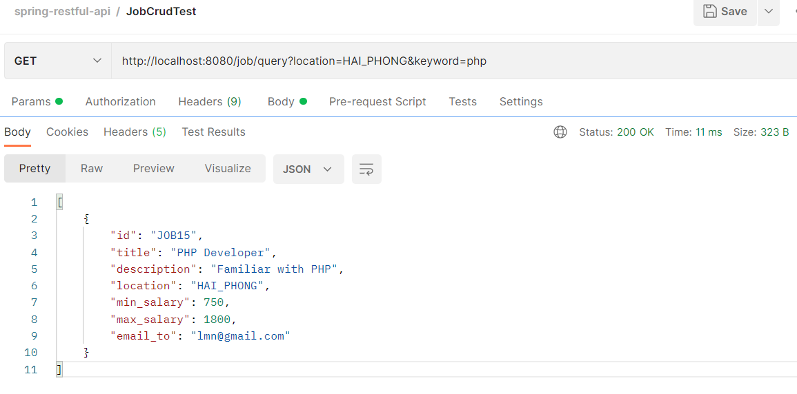

## Crud Jobs App Images

1. Get all jobs
- 
---
2. Get job by id
- 
---
3. Create new job
- 
---
4. Update job by id
- 
---
5. Delete job
- 
---
6. Sort jobs by location
- 
---
7. Find job by salary
- 
---
8. Find job by keyword (title or description)
- By title:
  
- By description:
     
---
9. Find job by location and keyword
- 

